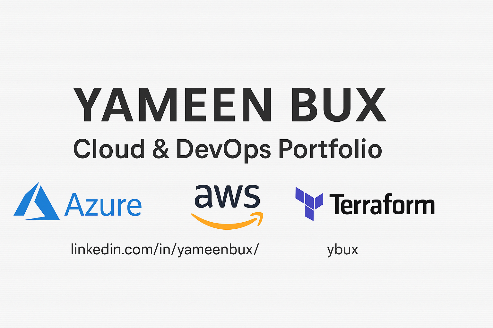

# ☁️ Cloud Portfolio — Yameen Bux

Welcome to my Cloud & DevOps portfolio — a showcase of hands-on projects and automation scripts as I transition into cloud contracting.

---

## 🔧 Core Skills

- **Cloud Platforms**: Azure (AZ-900 Certified), AWS (in progress)
- **Infrastructure as Code**: Terraform, Bicep (coming soon)
- **Automation & Scripting**: PowerShell, Azure CLI
- **CI/CD & Git**: GitHub, GitHub Actions (coming soon)
- **Containers & Orchestration**: Kubernetes (in progress)

---

## 📁 Project Directory

| Folder | Description |
|--------|-------------|
| [`terraform-projects`](./terraform-projects) | Real-world Terraform builds (VMs, Resource Groups) |
| [`scripts-toolkit`](./scripts-toolkit) | PowerShell automation for Azure management |
| `aws-projects` | *Coming soon*: AWS infrastructure examples |
| `ci-cd-examples` | *Coming soon*: GitHub Actions & pipeline workflows |
| `kubernetes-lab` | *Coming soon*: Cluster deployments and manifests |

---

## 🚀 Featured Projects

### ▶️ [`terraform-projects/azure-vm-simulation`](./terraform-projects/azure-vm-simulation)
Deploys a virtual machine on Azure using Terraform with reusable modules and variables.

### ▶️ [`scripts-toolkit`](./scripts-toolkit)
PowerShell scripts to manage Azure CLI logins, list resources, and automate common tasks.

---

## 💡 My Goals

- Build technical confidence across Azure, AWS & DevOps tools
- Use GitHub to showcase project-based learning and growth

---

## 📫 Let’s Connect

**Yameen Bux**  
Senior IT Infrastructure Engineer → Aspiring Cloud Contractor  
[🔗 LinkedIn](https://www.linkedin.com/in/yameenbux/)
